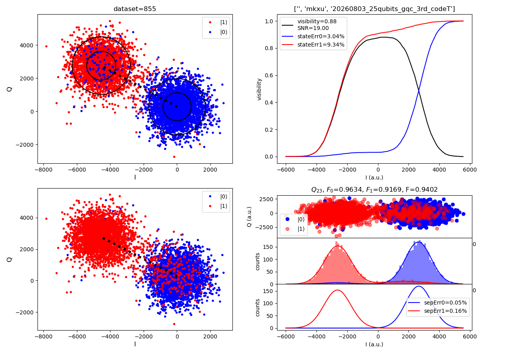

# IQ readout, assignment fidelity, and the four-panel 0918 figure

Consolidated 2026-09-29 from the reader's questions. [Reading map](../maps/superconducting-qubit-calibration.md) · [Calibration physics](superconducting-qubit-calibration.md).

## Codex interpretation: what is being measured?

The physical question is whether a microwave measurement distinguishes two intended qubit preparations. Dispersive coupling makes the readout resonator's response depend on the qubit state. Electronics demodulate/integrate the response into a point $z=I+iQ$. I and Q describe the measured field; they are not the coefficients α and β in a qubit wavefunction.

An intended ground preparation and an intended excited preparation generate distributions of IQ points. A classifier maps each point to an assigned state. Preparation is a control-sequence label; assignment is a data-analysis decision. Neither alone reveals the error-free physical state of every shot.

The general readout mechanism is described in Krantz Sec. V.A–C, especially Fig. 22 (one acquired trace becomes one IQ point), and Blais Sec. V.C.1–2. Those sources do not define this dataset's plotting implementation.

## The actual four-panel figure



Original plot copied byte-for-byte; not regenerated or relabeled. The discussion below separates visible labels and verified arithmetic from inferred plot semantics. The original figure includes its own acquisition provenance text.

### Shared labels and settings

| Label | Meaning | Evidence boundary |
| --- | --- | --- |
| `dataset=855` | Acquisition record ID; matches file prefix `00855` | Not a shot count or measured response |
| `Q23` / `q23` | Qubit identifier | Not qubit frequency or fidelity |
| Blue ground-state label, red excited-state label | Labels attached to plotted groups | Exact coloring semantics of the two left panels remain unresolved |
| I, Q | Signed field-response coordinates | Arbitrary readout units, not probabilities |
| `a.u.` | Arbitrary units | No absolute voltage or photon-number calibration established |
| `counts` | Samples in a histogram bin | Depends on bin width; not a probability percentage |
| `−18.0 dBm` | Recorded readout power setting in the filename/workbook | Does not establish power at the chip after attenuation/gain |
| `2.1 us` | Recorded readout duration setting | Not T1, T2, or the π rotation angle |

The upper-right header contains an acquisition path/group string. It is provenance text, not a physical observable. This note does not interpret its date-like substring as the verified acquisition date.

The raw array has shape **(3200, 5)**:

```text
shot index, I without π, Q without π, I with π, Q with π
0,          1010,        150,         -3165,    3763
```

The INI explicitly names these preparation channels. There are 3,200 IQ samples per preparation, or 6,400 IQ points in total. A row packages one point from each group; it does not establish simultaneous measurement of two states or their wall-clock acquisition ordering.

### Upper left: locations and widths of the signal clouds

Each dot has an I coordinate and a Q coordinate. Negative coordinates are normal. The workbook reports:

| Quantity | Reported value |
| --- | --- |
| cluster0_center | (16.53, 274.37) |
| cluster1_center | (−4535.65, 2761.58) |
| separation | 5187.35 a.u. |

The Euclidean distance between displayed centers is consistent with the reported separation to the displayed rounding precision:

$$
d=\sqrt{(I_1-I_0)^2+(Q_1-Q_0)^2}.
$$

This checks arithmetic, not the estimator or fidelity. Separation must be assessed relative to cloud widths. The black circles appear to depict fitted widths, but their confidence level and covariance convention are unknown. The dotted segment appears to connect the centers; it should not be called the decision boundary, which would generally separate the clouds rather than join them.

The reported centers are not simply means of the two raw preparation groups. Direct CSV means are approximately (−79.69, 321.55) without π and (−4164.88, 2564.39) with π. Component fits and whole-group means need not agree when groups are mixtures. The actual center estimator remains undocumented.

### Lower left: two labeled groups with opposite-cloud points

The left cloud is mostly red and the right mostly blue, but points of the opposite color occur in both. Under preparation-based coloring, these would be shots whose signal resembles the other preparation's main response. Preparation errors, relaxation, and measurement errors can all contribute; the scatter alone cannot distinguish them.

> [!hypothesis]
> Suggested by Codex; not yet verified. The two left panels may distinguish fitted component assignments from preparation labels or apply different processing. Their different color patterns motivate this possibility, but the plot legend alone does not settle it. Recover the plotting code or labeled intermediate arrays before asserting an exact mapping. An earlier conversational explanation suggested this distinction too strongly; it is not established here.

### Lower right: projection, counts, and fitted components

This quadrant has three stacked axes.

1. **Top:** an apparent transformed IQ scatter; the clouds separate mainly horizontally near −2500 and +2500. The horizontal label is I, but the coordinates appear rotated/translated relative to the left panels. The transform is not provided.
2. **Middle:** histograms and fitted distributions. A height of 150 means about 150 samples in that interval, not 150% probability. Smooth curves describe fitted distributions rather than time evolution.
3. **Bottom:** fitted main components and labels `sepErr0=0.05%`, `sepErr1=0.16%`. These look like component-overlap errors. The estimator, boundary, and normalization are unverified.

A common scalar discriminator is $s=w_I I+w_Q Q$, followed by a threshold. This is generally more informative than magnitude alone. For example, points (1,0) and (−1,0) have identical magnitude 1 but are distinguishable by I. Therefore, a one-dimensional histogram does not necessarily discard the useful phase information: a signed projection can preserve it.

Gaussian mixture model (GMM) means a weighted combination of Gaussian distributions, for example

$$
p(s\mid\mathrm{prep}\,j)=\sum_k w_{jk}\,\mathcal N(s;\mu_k,\sigma_k^2),
\quad w_{jk}\geq0,\quad\sum_k w_{jk}=1.
$$

This is an explanatory example, not a reconstruction of the unavailable fitter. A preparation group can have a large main component and a smaller opposite-state component. Component overlap and preparation-to-assignment errors then quantify different things.

### The title numbers: F0, F1, F

Use an explicit convention:

$$
F_0=P(\mathrm{assign}\,0\mid\mathrm{prepare}\,0),\qquad
F_1=P(\mathrm{assign}\,1\mid\mathrm{prepare}\,1),\qquad
F_{\mathrm{assign}}=(F_0+F_1)/2.
$$

For this figure:

| Label | Displayed value | Usual interpretation |
| --- | ---: | --- |
| F0 | 0.9634 | 96.34% correct assignment for intended preparation 0 |
| F1 | 0.9169 | 91.69% correct assignment for intended preparation 1 |
| F | 0.9402 | 94.02% balanced assignment accuracy |

The arithmetic is verified: $(0.9634+0.9169)/2=0.94015$, rounding to 0.9402. This does not verify the original classifier, train/test split, or physical preparation fidelity.

With matrix rows = assigned state and columns = intended preparation, the corresponding reported assignment matrix would be

$$
A=\begin{pmatrix}0.9634&0.0831\\0.0366&0.9169\end{pmatrix}.
$$

Each column sums to one. These decimals are inferred from the displayed F0/F1 convention, not an independently recovered count matrix. A classifier assessed on the same data used to fit it can overstate performance; the original validation protocol is unknown. The local audit's held-out linear classifier is a different estimator, not a reproduction of these GMM numbers.

### Upper right: threshold sweep and visibility

The red and blue rising curves resemble cumulative distributions. Define, for a scalar threshold t,

$$
C_j(t)=P(s\leq t\mid\mathrm{prepare}\,j).
$$

A value 0.8 means 80% of the group lies to the left of t. Because red is predominantly left and blue predominantly right, consider assigning left to 1 and right to 0:

$$
F_1(t)=C_1(t),\qquad F_0(t)=1-C_0(t),
$$

$$
F_{\mathrm{assign}}(t)=\frac{1+C_1(t)-C_0(t)}2.
$$

Thus maximizing the CDF difference finds the best threshold **for balanced class weighting, this orientation, and the one-threshold classifier**. This is not necessarily the optimum among arbitrary two-dimensional classifiers or for unequal error costs.

The black curve appears to be this difference; it tends toward zero in both tails and peaks between the clouds. The numbers are consistent with

$$
V=F_0+F_1-1=2F_{\mathrm{assign}}-1=0.8803.
$$

This matches workbook visibility 0.8803 and plotted `visibility=0.88`. It supports the proposed convention arithmetically; it does not recover the missing original code or establish that its threshold procedure was exactly the one above. Do not infer V from twice the rounded displayed F and expect all final digits to match.

### Why the error labels must stay separate

| Quantity | Value in this case | What is established |
| --- | ---: | --- |
| $1-F_0$ | 3.66% | Complement of reported F0 under the assignment definition |
| $1-F_1$ | 8.31% | Complement of reported F1 |
| `stateErr0` | 3.04% | Additional reported estimate; not equal to $1-F_0$ |
| `stateErr1` | 9.34% | Additional reported estimate; not equal to $1-F_1$ |
| `sepErr0` | 0.05% | Appears associated with fitted component overlap; exact calculation missing |
| `sepErr1` | 0.16% | Same qualification |
| `SNR` | 19.00 | Reported signal-to-noise statistic with undocumented convention |

Do not add `stateErr` and `sepErr` to reconstruct total errors without the estimator's decomposition. Do not treat SNR 19 as 19%, 19 dB, or a fixed multiple of a standard deviation without its definition.

Krantz Sec. V.C (pp. 47–48) distinguishes distribution-overlap error from additional errors due to state transitions during readout. Blais Sec. V.C.2 likewise explains relaxation/non-Gaussian limits. This supports the conceptual distinction, but does not identify which mechanism produced the local `stateErr` numbers.

## Fidelity conventions across references

Blais Eq. (116) uses a contrast-style measurement fidelity

$$
F_m=1-(\epsilon_0+\epsilon_1).
$$

Balanced assignment fidelity instead is

$$
F_{\mathrm{assign}}=1-\frac{\epsilon_0+\epsilon_1}{2}.
$$

For the same two errors, $F_m=2F_{\mathrm{assign}}-1$. Accordingly, “88%” under one convention can correspond to “94%” under the other. Always compare definitions before comparing numbers. The downloaded Blais v1 footnote 7 contains an apparent sign typo in its alternative definition; see the [source annotation](../discussions/superconducting-qubit-calibration/references.md#source-version-caution). The formulas here follow the explicit probability definitions and Eq. (116), not that typo.

## Reader questions

Reader's words from the discussion, preserved without claiming that the explanation was adopted:

> the figure in this expermient show four subfigure. which make me confused. any suggestions?

> where you know the prepare state. And the assign state. And the figure seems only amp value. we can assign the sate just from amp?

> can you explain more about the number and label in The four subfigures in the readout experiment

Suggested reading order: lower-left clouds → lower-right projected histograms → F0/F1/F → upper-right threshold curves → fitted component/error labels. Unresolved interpretations are tracked in [the provenance question](../questions/0918-readout-estimator-provenance.md).

## Local evidence and provenance

Checked 2026-09-29. Original files remain in the sibling repository; only the figure is copied here. No analysis source for the original four-panel plot was found in the current calibration scripts.

- [Original figure](<../../agent_control/data/0918/GMM Readout Clusters/001/q23IQraw_-18.0 dBm_2.1 us.png>), copied to `assets/0918-readout-case-001.png`. SHA-256: `d0d9d762bec42db6eebe2202e4d0f3054edd19a6b541d3b7fe6698b8657edcef`.
- [CSV](<../../agent_control/data/0918/GMM Readout Clusters/001/00855 - q23%c IQ raw.csv>). SHA-256: `e15d691c57a6dd4e51a444983383fd4b32d356898f20030e9c8f1040090161cd`.
- [INI](<../../agent_control/data/0918/GMM Readout Clusters/001/00855 - q23%c IQ raw.ini>), especially Dependent 1–4. SHA-256: `cb59b3aa8c32f8467900a97332ffb38dad72bbadf2f89449b810490e8e4396d1`.
- [Workbook](../../agent_control/data/0918/meta_info_cn_v2.xlsx), `Sheet1!F42` for important values, row 42 for case metadata. SHA-256: `101abc04cb34a6bd497d7739b37cba94242021a86bc9028d0c080aa48908a618`.
- External physics sources: [Krantz](../discussions/superconducting-qubit-calibration/references.md#a-quantum-engineers-guide-to-superconducting-qubits), [Blais](../discussions/superconducting-qubit-calibration/references.md#circuit-quantum-electrodynamics), [Qiskit assignment-matrix reference](../discussions/superconducting-qubit-calibration/note.md#reading-order-and-references).

2026-09-29 — Codex consolidation: exact panel color semantics, circle levels, coordinate transforms, and the `stateErr`/`sepErr`/SNR estimators remain unverified. Literature references do not turn these local ambiguities into established facts.
