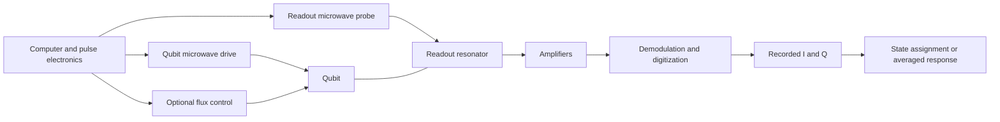

# Superconducting-qubit hardware, microwave signals, and calibration

Added 2026-10-08 from the reader's continuing 0918 discussion. [Reading map](../maps/superconducting-qubit-calibration.md) · [Calibration quantities](superconducting-qubit-calibration.md) · [Four-panel IQ readout](iq-readout-and-assignment.md).

## Codex interpretation: scope and organizing idea

The qubit stores the quantum state; a drive pulse changes it; a readout resonator helps measure it. Electronics generate, route, amplify, and record the signals. This note explains a common transmon/dispersive-readout architecture. It does not reconstruct the 0918 wiring, pulse programs, or measurement hardware from their CSVs.

Keep four objects distinct: a physical device, its quantum state, an applied electrical signal, and the quantity recorded by the electronics. A resonance is a characteristic response frequency of a device, not another device or another microwave source.

## Codex interpretation: what the hardware does

The diagram shows functional paths, not a complete wiring schematic. In a common implementation the chip is at approximately 10–20 mK in a dilution refrigerator; incoming attenuation is distributed across temperature stages, while much signal generation and processing happens at room temperature. Exact temperatures and components vary.

| Component | Function | Connection to calibration |
| --- | --- | --- |
| Transmon: Josephson junction shunted by capacitance | Provides a nonlinear quantum oscillator whose lowest two levels encode the qubit | Its level spacing sets the candidate qubit transition frequency |
| Qubit drive line | Applies shaped microwave fields to rotate the state | Spectroscopy and Rabi vary controls on this path |
| Readout resonator | Has a state-dependent response through coupling to the qubit | Resonator spectroscopy and readout tuning characterize this path |
| Readout feedline | Carries the probe and outgoing response | Multiple resonators can share a line at different frequencies |
| Optional flux line | Changes a tunable qubit's frequency or a tunable coupler's interaction | DC bias and shaped flux pulses differ from a resonant qubit microwave drive |
| Waveform generator/DAC, microwave source, and mixer | Set carrier frequency and pulse envelope/phase | A control-amplitude setting need not equal a calibrated voltage at the chip |
| Filters and attenuators | Suppress unwanted spectral content and incoming thermal noise | Affect the signal and noise actually reaching the chip |
| Isolators/circulators and amplifiers | Route/protect the output path and amplify a weak microwave response | Their noise and loss affect IQ-cloud separation |
| Mixer/reference oscillator, ADC, and FPGA | Downconvert, sample, and process the response | Produce digital quadratures and integrated IQ observations |
| Optional Purcell filter | Allows readout output while suppressing qubit decay through that path | Helps balance readout speed against relaxation |
| Coupler or bus resonator in some multi-qubit architectures | Mediates qubit interactions | Has a different role from the readout resonator |

Blais Fig. 14 is a particularly useful reference for the measurement path and temperature stages. It depicts the resonator as a cavity; on-chip implementations can use other resonator geometries.

## Codex interpretation: why there are many microwave signals

| Signal | Frequency's role | Strength's role |
| --- | --- | --- |
| Qubit drive | Usually near the qubit transition being addressed | Controls rotation speed in the approximately linear drive regime |
| Readout probe | Near a readout-resonator resonance | Controls measurement signal, photon population, and backaction |
| Local oscillator/reference | Generates or demodulates another signal in electronics | Controls electronic frequency conversion; it need not reach the qubit |
| Amplifier pump, when used | Enables parametric amplification | Controls amplifier operation rather than serving as the intended qubit flip pulse |

Several carriers may be synthesized together and share a cable. Counting frequencies is therefore not the same as counting independent generators or circuits. Not every signal is intended to excite the qubit.

## Codex interpretation: energy levels and mathematical models

### Energy levels and the computational basis

Planck's constant is exactly $h=6.62607015\times10^{-34}$ J s; $\hbar=h/(2\pi)$. Ordinary frequency $f$ and angular frequency $\omega$ satisfy $\omega=2\pi f$, so

$$
E_1-E_0=hf_{10}=\hbar\omega_{10}.
$$

For the standard transmon encoding, |0⟩ is the ground energy eigenstate and |1⟩ the first excited energy eigenstate. The device determines the levels; we select and label a computational subspace. Other encodings and bases are possible, but this note's $f_{10}$ refers to the energy-basis transition.

We want levels that can be controlled, measured, and preserved long enough for the task. Unequal adjacent spacings help address 0↔1 without driving 1↔2. Higher levels still exist; populating them unintentionally is leakage. Krantz Fig. 1 and Sec. II.A explain this selection and the role of nonlinearity.

### Resonator and transmon

For an ideal lumped LC resonator,

$$
f_r=\frac{1}{2\pi\sqrt{LC}}.
$$

L is inductance and C capacitance. Energy oscillates between magnetic and electrical storage. A distributed resonator can behave approximately like this model near one mode.

In the simplified transmon model used in Krantz Eq. (16), with offset charge omitted,

$$
H_q=4E_C\hat n^2-E_J\cos\hat\varphi.
$$

The Hamiltonian $H_q$ describes energy. $E_C=e^2/(2C_\Sigma)$ is the charging-energy scale, $E_J$ the Josephson-energy scale, $\hat n$ the excess Cooper-pair number operator, and $\hat\varphi$ the junction phase operator. Solving this model gives energy levels and transition frequencies. The circuit phase $\hat\varphi$ is distinct from a microwave carrier phase or the plotted phase of a measured response.

### Drive: frequency, amplitude, time, and phase

A simplified drive voltage is

$$
V_d(t)=A(t)\cos(2\pi f_dt+\phi_d).
$$

Carrier frequency $f_d$ addresses a transition; envelope $A(t)$ sets drive strength over time; duration determines how long it acts; carrier phase $\phi_d$ sets the transverse rotation axis. On resonance with a fixed axis,

$$
\theta=\int\Omega(t)\,dt,\qquad P_1=\sin^2(\theta/2)
$$

for an ideal initially-ground-state qubit. $\Omega(t)$ is angular Rabi frequency, approximately proportional to the envelope in a linear regime. A constant envelope gives $\theta=\Omega T$. A π pulse has rotation angle π radians, not necessarily carrier phase π.

Amplitude Rabi varies strength at fixed duration; time Rabi varies duration at fixed strength. Both normally hold carrier frequency near resonance. The existing 0918 notes identify its Rabi scans as amplitude scans; the CSV amplitude settings alone do not establish calibrated drive voltages or the complete envelope. Krantz Eqs. (92)–(94) give the general control relation.

A π/2 pulse prepares equal populations from |0⟩, with state of the form $(|0\rangle+e^{i\phi}|1\rangle)/\sqrt2$, up to a global phase. The amplitudes have magnitude $1/\sqrt2$ and probabilities are 1/2. The relative phase depends on the pulse convention; it is not determined by a population-only CSV.

### Dispersive readout and recorded IQ

Blais Eq. (107) gives the approximate two-level dispersive model

$$
H_{\mathrm{disp}}/\hbar=(\omega_r+\chi\sigma_z)a^\dagger a+\frac{\omega_q}{2}\sigma_z.
$$

With $\sigma_z|0\rangle=-|0\rangle$ and $\sigma_z|1\rangle=+|1\rangle$, the resonator frequencies are $\omega_{r,0}=\omega_r-\chi$ and $\omega_{r,1}=\omega_r+\chi$. Here $a^\dagger a$ is photon number and $\chi$ is the dispersive shift. This approximation truncates the qubit, absorbs Lamb shifts into frequencies, and neglects resonator nonlinearity; high readout power can invalidate it.

The probe produces different complex resonator responses for the two states. Amplification, demodulation, and integration turn them into measured $z=I+iQ$. I and Q are electrical-response coordinates, not the coefficients of the qubit wavefunction. Repeated observations form IQ distributions; a classifier uses their separation to assign states. Preparation procedures associate distributions with nominal 0 and 1, with preparation errors remaining possible.

See Blais Fig. 16 and Krantz Fig. 22 for the acquisition chain. These general diagrams do not recover the integration weights or normalization used in 0918.

## Codex interpretation: can we predict peak or dip before a scan?

Often yes after establishing the measurement convention and reference responses, but the physical goal does not fix the plotted polarity. A new device or newly chosen readout frequency may need a preliminary scan before the sign is known.

For a linear scalar readout or fixed IQ projection,

$$
y=y_0+(y_1-y_0)P_1.
$$

If a qubit-frequency scan starts mainly in |0⟩, an excitation feature increases $P_1$. If $y_1>y_0$, that gives a peak; if $y_1<y_0$, it gives a dip. For example, with off-resonant $P_1\approx0$ and resonant $P_1=0.5$:

| Illustrative references | Off resonance | At resonance | Feature |
| --- | ---: | ---: | --- |
| $y_0=10,\ y_1=20$ | 10 | 15 | Peak |
| $y_0=20,\ y_1=10$ | 20 | 15 | Dip |

These are invented teaching values, not 0918 observations. Both rows describe increased excitation. Taking IQ magnitude or phase is nonlinear, so this linear formula need not describe those plotted observables.

Once references are available, a calibrated linear signal $p=(y-y_0)/(y_1-y_0)$ increases toward 1 for either raw polarity. That normalization is model-dependent; noisy estimates may leave [0,1], and nominal preparations may be imperfect. Changing the sign of an IQ projection also reverses polarity without changing the physics. The design goal is useful state contrast, not a tall upward peak.

A resonator-frequency scan is different: changing probe frequency changes the circuit's scattering response even if the qubit stays in |0⟩. Interference between a direct wave and a resonator-mediated wave can produce a transmission notch despite strong internal response. A peak, dip, or phase feature can locate resonance; attributing a particular 0918 line shape requires its topology and acquisition details. Blais Fig. 19 explains state-dependent transmission and phase but does not uniquely diagnose the local spectra.

## Codex interpretation: the calibration progression

This is a common practical dependency sequence, not a verified chronological reconstruction of the 0918 cases.

| Stage | Action | What it enables |
| --- | --- | --- |
| 1 | Check signal paths and locate readout resonances | Candidate readout probe settings |
| 2 | Establish a preliminary averaged response | Detect changes before full single-shot classification |
| 3 | Sweep qubit drive frequency | Candidate transition frequency |
| 4 | Run amplitude or time Rabi near resonance | Approximate π and π/2 rotations |
| 5 | Compare nominal no-π/with-π IQ distributions and tune readout | Better assignment and contrast |
| 6 | Refine frequency and pulses, then run T1 and Ramsey | Relaxation and coherence characterization |
| 7 | Repeat relevant calibrations as settings drift | Maintain useful controls and readout |

GMM readout benefits from an approximate π pulse; pulse calibration benefits from usable readout. Therefore stages form an iterative loop. Initial spectroscopy/Rabi can use averaged IQ without a final single-shot classifier. T1 and Ramsey infer dynamical properties through calibrated preparation and measurement, rather than fitting arbitrary numbers to a formula.

## Source claims and evidence

| Source and location in local version | Source mechanism used here |
| --- | --- |
| [Krantz reference and PDF](../discussions/superconducting-qubit-calibration/references.md#a-quantum-engineers-guide-to-superconducting-qubits), Sec. II.A, pp. 4–5, Fig. 1 and Eqs. (13)–(16) | Linear oscillator versus Josephson oscillator, energy-level selection, and transmon Hamiltonian |
| Krantz Sec. IV.D.1, p. 29, Eqs. (92)–(94) | Drive envelope and phase control rotations; multiplexed drive synthesis |
| Krantz Sec. V.B, Fig. 22, p. 45 | Heterodyne acquisition and processing into IQ |
| [Blais reference and PDF](../discussions/superconducting-qubit-calibration/references.md#circuit-quantum-electrodynamics), Sec. V.A, pp. 25–27, Figs. 14 and 16 | Measurement chain, attenuation, amplification, reference oscillator, and IQ mixing |
| Blais Sec. V.C.1, pp. 29–31, Eqs. (107), (110), Fig. 19 | State-dependent resonator shift and complex response |

The polarity example and calibration sequence are Codex explanatory syntheses. The references establish general mechanisms, not the undocumented 0918 estimator or wiring. On 2026-10-08 these source passages were read selectively by local text extraction; Krantz p. 5 and Blais p. 29 were also rendered and visually checked. Page labels match PDF indices at these cited locations. Neither paper was read in full.

## Reader questions and open provenance

Reader questions retained as questions, not statements of endorsed understanding:

> while, the h is the constant?

> if this meaning the |0> and |1> are some sates we choose? if so, is there any principle?

> can you explain again why some are peak, some are dip. If the direction from |0> to |1>, or reverse

> It looks there are so many miscrowave, so many circuits. Can you introduce those in mainstream setup. what's their work, and if any math model.

> which means we know we want peak or dip when desgin the experiment?

2026-10-08 — Codex explanation: answers above distinguish energy states, signal controls, response polarity, and iterative calibration. Reader endorsement is not inferred. Corpus-specific open questions remain: which readout observable and averaging order produced each plot, what pulse envelopes were used, and what actual topology connected the chip? Original acquisition/plotting code and wiring documentation would answer these; see the [existing provenance question](../questions/0918-readout-estimator-provenance.md).
